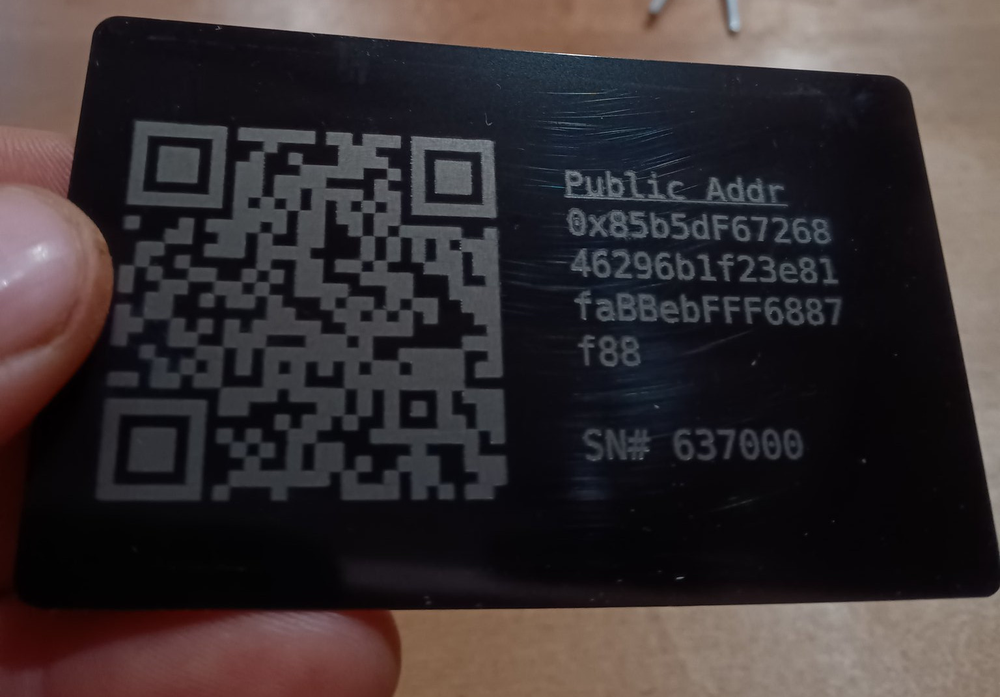
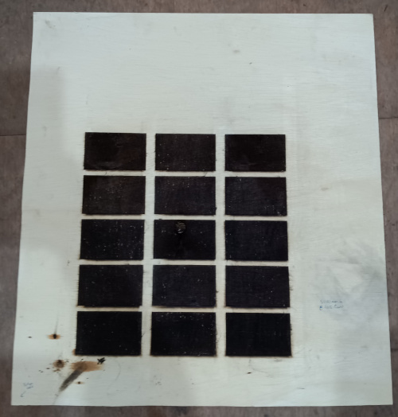
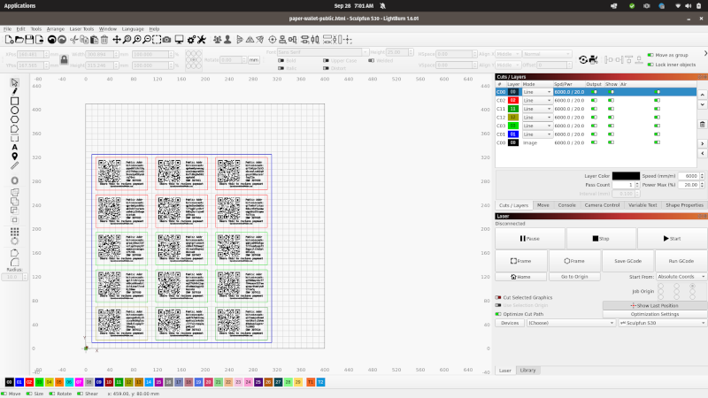
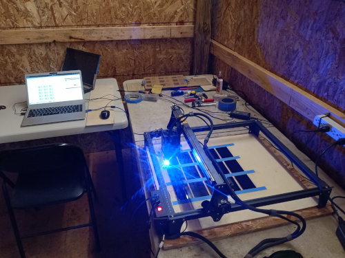
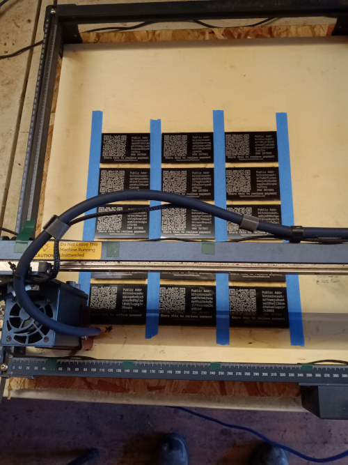

# Metal Wallets

A range of desktop laser engravers are widely available. The metal wallet pictured below was produced with a [Sculpfun S30 Pro](https://amzn.to/3BvKes0) with a 20 watt laser, using these [stainless steel business cards](https://amzn.to/3BmLu0I). The card is powder coated with black pain, and the laser is used to blast the paint off the card, to expose the underlying stainless steel.

## Lightburn

[Lightburn](https://lightburnsoftware.com/) is the most common software used to control these desktop laser engravers. [This stencil file](./static/3x15-frame.lbrn2) can be downloaded and used to create a frame for holding the business cards, to generate up to 15 metal wallets at a time.

Wooden frame used to hold up to 15 metal wallets for laser engraving.

Screenshot of Lightburn with a batch of metal wallets overlaid on the frame file.

## Artwork

The artwork for generating these metal wallets [is available on GitHub](https://github.com/christroutner/plastic-wallet). The steps are the same as in [the plastic wallet video](https://youtu.be/3qn0mmfwlBQ), but the following command is used:

- `npm run bch:bulk`

## Links

- [Lightburn](https://lightburnsoftware.com/)
- [Frame file](./static/3x15-frame.lbrn2)
- [Sculpfun S30 Pro](https://amzn.to/3BvKes0)
- [Stainless Steel business cards](https://amzn.to/3BmLu0I)
- [Artwork generation software](https://github.com/christroutner/plastic-wallet)

## More Pictures

