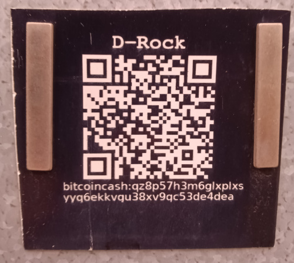

# Plastic Wallets

The original inspiration for this site was based on the video below. It introduces the idea of using a 3-watt, toy laser engraver to engrave a 'paper' wallet onto a PVC plastic business card.

<iframe width="500" height="282" src="https://www.youtube.com/embed/3qn0mmfwlBQ" title="Laser Engraved Plastic BCH Wallet" frameborder="0" allow="accelerometer; autoplay; clipboard-write; encrypted-media; gyroscope; picture-in-picture; web-share; fullscreen" referrerpolicy="strict-origin-when-cross-origin" allowfullscreen></iframe>

- The source code for generating the artwork is [available on GitHub](https://github.com/christroutner/plastic-wallet).
- The laser engraver used in the video is not available, but [this is a similar one](https://amzn.to/3Y2rgly).
- [These are the business cards used.](https://amzn.to/3bV3cHj)

## PVC Fumes

While the PVC plastic cards engrave well, and the plastic is super durable, it can be dangerous to laser-engrave PVC. It generates chlorine gas which is stinky, toxic, and highly corrosive. After engraving about a hundred plastic wallets, the electronics on the laser engraver has oxidized badly.

If you choose to engrave on plastic, be sure to do it outside or in a well ventilated area.

## Acrylic Signs

Another option for business signage is these [two-color acrylic sheets](https://amzn.to/47IJRGG). They do not produce the fumes that PVC does, and they are UV stable. These make great signs for businesses that want to accept BCH.

The sign pictured here has been outside, in the sun for over two years. It is still easy to scan the QR code with a phone.

