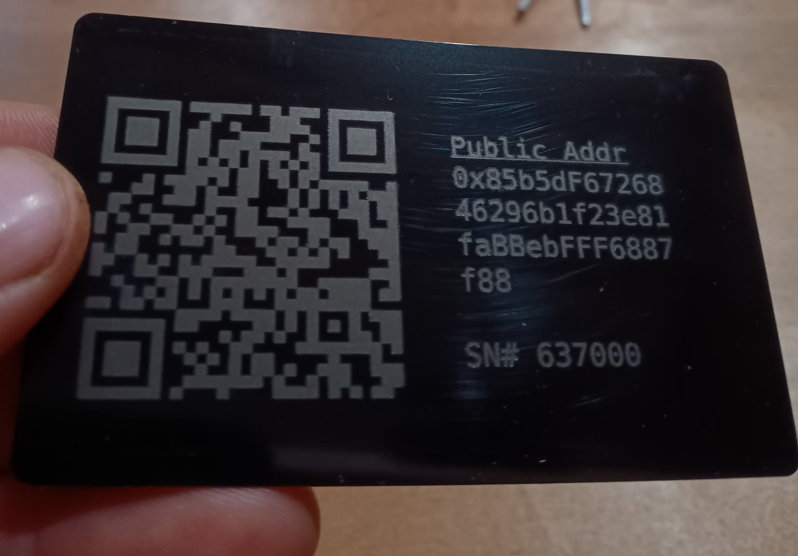

# Carteras de metal

Existe una amplia gama de grabadores láser de escritorio disponibles. La billetera de metal que se muestra a continuación se fabricó con un [Sculpfun S30 Pro](https://amzn.to/3BvKes0)con un láser de 20 vatios, utilizando estas [tarjetas de presentación de acero inoxidable](https://amzn.to/3BmLu0I). La tarjeta está recubierta de pintura en polvo negra y se utiliza un láser para quitar la pintura de la tarjeta y exponer el acero inoxidable subyacente.

## Lightburn

[Lightburn](https://lightburnsoftware.com/) Es el software más común utilizado para controlar estos grabadores láser de escritorio. [Este archivo de plantilla](./static/3x15-frame.lbrn2) Se puede descargar y utilizar para crear un marco para guardar tarjetas de presentación y generar hasta 15 billeteras de metal a la vez.

Marco de madera utilizado para albergar hasta 15 carteras metálicas para grabado láser.

Captura de pantalla de Lightburn con un lote de billeteras de metal superpuestas en el archivo del marco.

## Artwork

El diseño para generar estas billeteras de metal [está disponible en GitHub](https://github.com/christroutner/plastic-wallet). Los pasos son los mismos que en [el video de la billetera de plástico](https://youtu.be/3qn0mmfwlBQ), pero se utiliza el siguiente comando:

- `npm run bch:bulk`

## Links

- [Lightburn](https://lightburnsoftware.com/)
- [Archivo de marco](./static/3x15-frame.lbrn2)
- [Sculpfun S30 Pro](https://amzn.to/3BvKes0)
- [Tarjetas de presentación de acero inoxidable](https://amzn.to/3BmLu0I)
- [Software de generación de ilustraciones](https://github.com/christroutner/plastic-wallet)

## More Pictures

