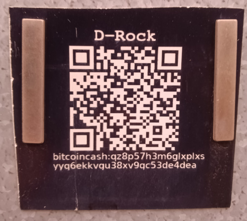

# Carteras de plástico

La inspiración original para este sitio se basó en el video que aparece a continuación. Presenta la idea de usar un grabador láser de juguete de 3 vatios para grabar una billetera de "papel" en una tarjeta de presentación de plástico PVC.

<iframe width="500" height="282" src="https://www.youtube.com/embed/3qn0mmfwlBQ" title="Laser Engraved Plastic BCH Wallet" frameborder="0" allow="accelerometer; autoplay; clipboard-write; encrypted-media; gyroscope; picture-in-picture; web-share; fullscreen" referrerpolicy="strict-origin-when-cross-origin" allowfullscreen></iframe>

- El código fuente para generar la obra de arte está [disponible en GitHub](https://github.com/christroutner/plastic-wallet).
- El grabador láser utilizado en el vídeo ya no está disponible, pero [este es uno similar](https://amzn.to/3Y2rgly).
- [Estas son las tarjetas de presentación utilizadas.](https://amzn.to/3bV3cHj)

Las mejores configuraciones para grabar las tarjetas:

1. Fuerza a 35%
2. Profundidad at 45%

Además, las tarjetas son brillantes. Lijalas con papel de lija de grano 80 antes de grabarlas. Este paso de preparación es fundamental. No se grabarán correctamente a menos que elimines el brillo.

## Humos de PVC

Si bien las tarjetas de plástico de PVC se graban bien y el plástico es muy duradero, puede ser peligroso grabar PVC con láser, ya que genera gas de cloro, que es maloliente, tóxico y altamente corrosivo. Después de grabar alrededor de cien billeteras de plástico, los componentes electrónicos del grabador láser se oxidaron gravemente.

Si decide grabar en plástico, asegúrese de hacerlo al aire libre o en un área bien ventilada.

## Letreros acrílicos

Otra opción para la señalización comercial son estas [láminas acrílicas de dos colores](https://amzn.to/47IJRGG). No producen los vapores que produce el PVC y son resistentes a los rayos UV. Son excelentes carteles para empresas que desean aceptar BCH.

El cartel que aparece en la imagen lleva más de dos años en el exterior, expuesto al sol. Aún es fácil escanear el código QR con un teléfono.

